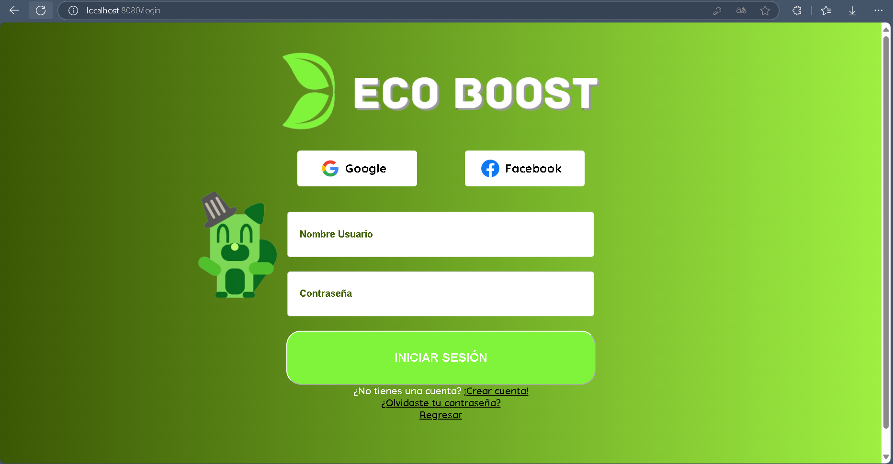
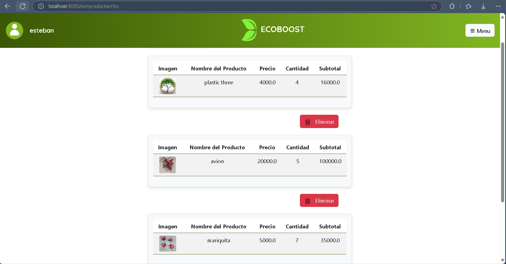
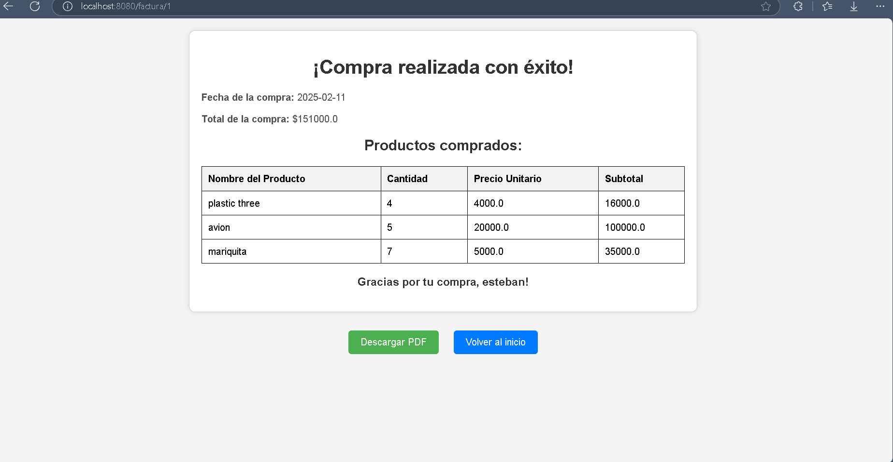

# ECO-BOOST

### Problematica que se aborda:
Según “Medellín Recicla”, la ciudad enfrenta una baja tasa de reciclaje efectivo,
especialmente de residuos plásticos, debido a la falta de educación ambiental y de
incentivos adecuados en la ciudad. En EcoBoost queremos desarrollar una
aplicación web que motivará a la población a reciclar más, ofreciendo recompensas
(eco points) y de esta forma, incrementar la contribución social en el ámbito del
reciclaje, reducir la cantidad de residuos contaminantes, y mejorar el cuidado del
medio ambiente.

### Pregunta de investigación:
¿Cómo se puede desarrollar una aplicación web responsive, para incentivar a la
educación ambiental y el reciclaje, contribuyendo así al cuidado del medio
ambiente?
#### Respuesta:
Una aplicación web responsive para la compra y venta de productos reciclables, desarrollada en Java con Spring Boot, HTML, CSS y una base de datos SQL Oracle, puede impulsar el crecimiento económico de oferentes y demandantes a nivel regional, nacional e incluso internacional. Además de expandir el alcance de los negocios independientes, esta plataforma fomenta el reciclaje y el cuidado del medio ambiente, contribuyendo a un planeta más limpio y sostenible.

### Objetivos específicos:
-Elicitar diferente información que permita estructuras las diferentes pautas del
proyecto.

-Analizar los datos e información obtenidos, para tener claro el sistema de reciclaje
categorizado por material y poder establecer productos reciclables específicos.

-Diseñar un prototipo funcional, que cumpla con el esquema base ya analizado del
Ecommerce, proporcionando una visión general más amplia del aplicativo.

-Construir una aplicación web responsive, que garantice la persistencia de datos
almacenándolos en un base de datos SQL Oracle, implementando así Java con Spring Boot, HTML,
CSS para su cómoda navegabilidad y funcionamiento.

-Validar las diferentes funcionalidades de la aplicación web con diferentes
potenciales usuarios y en diferentes dispositivos.

### Imagenes de la aplicación web:
#### 🔹HomePage

#### 🔹Registro  

#### 🔹Login

#### 🔹Panel de vendedor

#### 🔹Carrito de comprador

#### 🔹Factura

#### 🔹Perfil de usuario
